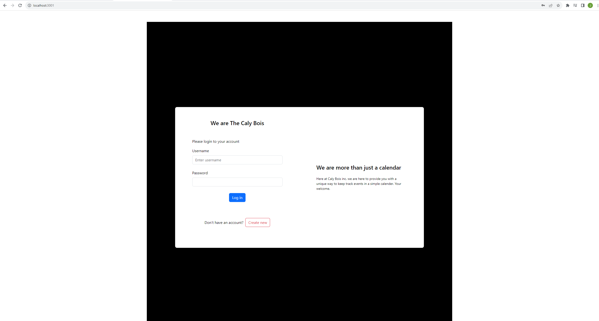
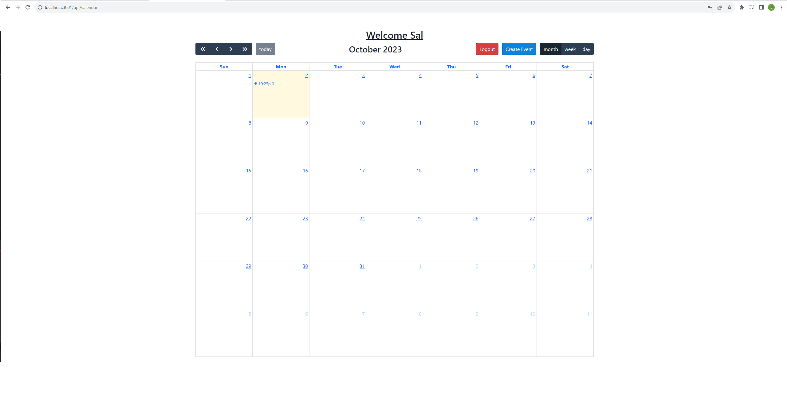
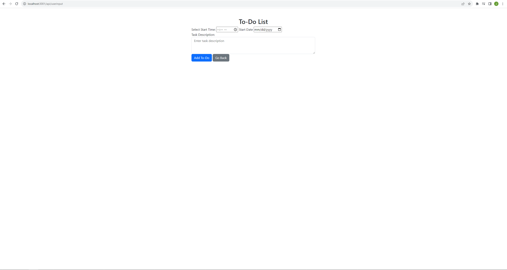
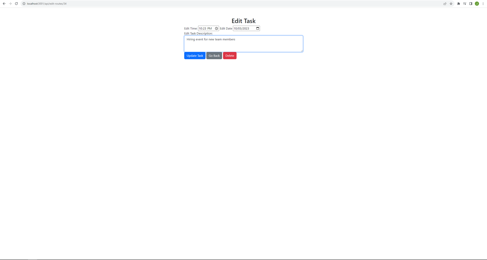
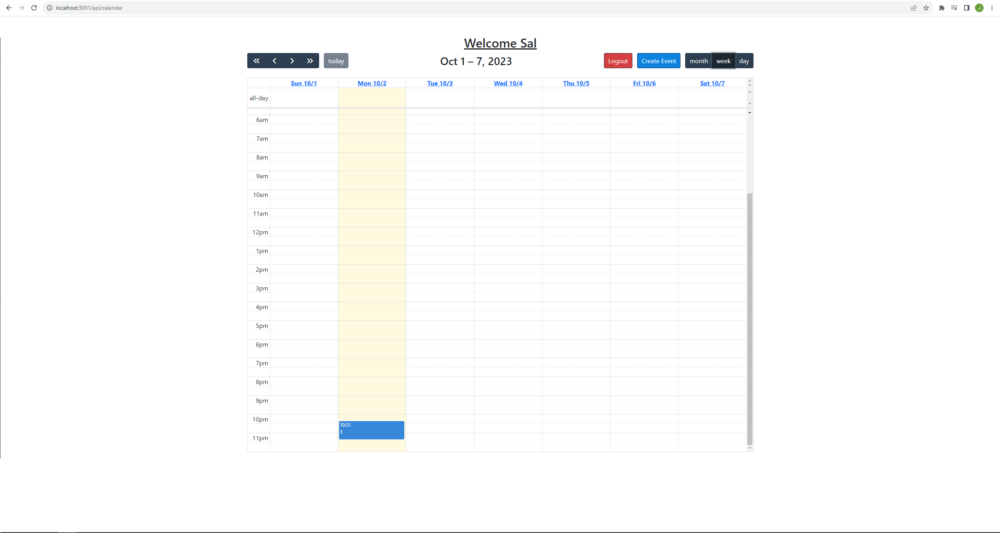
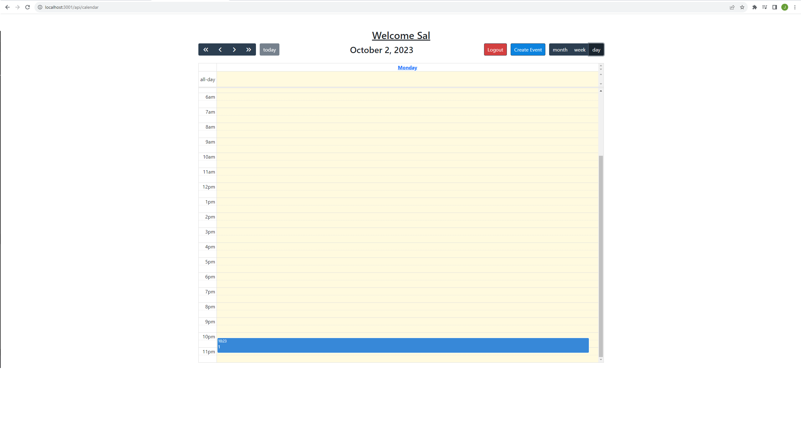

# Full Calendar Api
A powerful API for integrating FullCalendar into your web applications.
## Description
Using a Calendar API involves integrating a calendar service into your application or system, allowing you to manipulate and interact with calendar data programmatically. This API provides a set of endpoints and methods that enable developers to perform various operations such as creating events, retrieving event details, updating event information, and managing calendars.
## Deployed Application URL 
https://protected-taiga-58244-3710fb729053.herokuapp.com/
## Table of Contents
* [Description](#description)
* [Features](#features)
* [Languages & Dependencies](#languagesanddependencies)
* [How to Use This Application](#HowtoUseThisApplication)
* [Contributors](#contributors)
* [Contact-Us](#contact-us)
* [Questions](#questions)
* [Images](#images)
## Features
- Seamless integration with FullCalendar
- Customizable event handling
- Support for different calendar views (month, week, day)
- Responsive design for various screen sizes
## Languages & Dependencies
Node.js,Handlebars,HTML,CSS,BootStrap,JavaScript,MYSQL,Express.js,Web APIs,Sever-Side API
## How to Use This Application:
To start the applications you must first do a npm install then after you do a npm start. Then open your browser and type in Localhost:3001/.
After you done all this you can you sign in if you have pre-existing account or make a new account.
## Contributors
Javier Burgara, Phillip Nguyen, Justin Feagin, Matthew Kang
## Contact-Us
https://github.com/Pixls112
https://github.com/JavierBurgara
https://github.com/CJFeagin33
https://github.com/matthkang
## Questions
matthkang@gmail.com
nguyen.phillip112@gmail.com
javierburgara150@yahoo.com
## Image of Deployed Website
  
